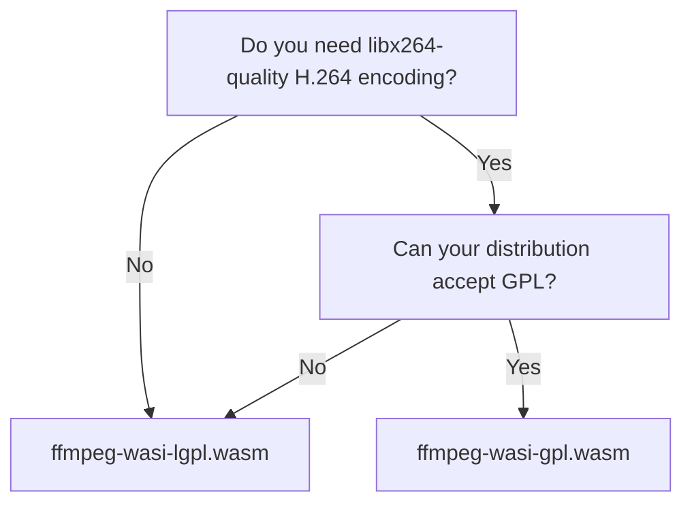

# Choose & verify a variant

Every release ships along three axes: a **runtime** (portable **WASM** modules, or native
**drivers**), a **licence variant** (LGPL/GPL), and a capability **profile** (lean/intermediate/
full). That's four WASM modules (2 variants × {lean, intermediate}) plus six native drivers (2
variants × {lean, intermediate, full}). Pick by **runtime**, **licence**, and **profile**, then
**verify** before you trust it.

## Which one?



- **`ffmpeg-wasi-lgpl.wasm`** — the default. LGPL-2.1+, proprietary-compatible. H.264 encode
  via openh264 (BSD); everything else in the [baseline](../reference/variants.md).
- **`ffmpeg-wasi-gpl.wasm`** — LGPL plus `--enable-gpl` + libx264 for best-in-class H.264
  encoding. The artifact is GPL-2.0+.

When in doubt, start with **LGPL**. See [the licensing model](../explanation/licensing.md) for
the full picture (and why shipping both together is clean).

## Which runtime?

- **WASM** (`ffmpeg-wasi-<…>.wasm`) — the default: a sandboxed, portable, arch-independent,
  single-threaded module. Run it anywhere via [afmpeg](https://afmpeg.phpboyscout.uk) + wazero.
- **Native driver** (`ffmpeg-wasi-driver-linux-amd64-<…>`) — the same engine as a native ELF with
  threads + SIMD (spec 0028), driven out-of-process by afmpeg's
  [native backend](https://afmpeg.phpboyscout.uk/how-to/use-the-native-backend/). Reach for it when
  you are encode- or throughput-bound (**48–58× faster** software encode), or need HEVC/AV1 (the
  full profile). linux/amd64 only for now.

## Which profile?

Each build comes in a capability profile (spec [0022](https://afmpeg.phpboyscout.uk/development/specs/0022-build-size-matrix/)):

- **lean** (default, `ffmpeg-wasi-<variant>.wasm`) — web-delivery essentials at the smallest size.
- **intermediate** (`ffmpeg-wasi-intermediate-<variant>.wasm`) — lean **+ every practical software
  codec/format/filter**: the LGPL encoders (Opus/MP3/Vorbis/VP8-9/WebP), the native codec and
  container batches, and text/subtitle burn-in. Larger, but no separate build.
- **full** (`ffmpeg-wasi-driver-linux-amd64-full-<variant>`) — intermediate **+ the heavy
  encoders**: AV1 (SVT-AV1, both variants) and HEVC (x265, **gpl only**). These need threads/SIMD, so
  full is **native-only** — there is no WASM full module.

Start with **lean**; reach for **intermediate** when you need a codec, container, or filter it
doesn't carry, and **full** (native) for HEVC/AV1 encode — see the
[capability tables](../reference/variants.md#profiles-capability-classes).

!!! warning "H.264 and AVC patents"
    Both variants encode H.264, and both are self-compiled — so neither rides under Cisco's
    openh264 binary patent grant. We ship encode under the AVC pool's royalty-free volume tier and
    will pull it on request; the obligation sunsets when the last AVC essential patent expires
    (2027-11-29 in the U.S.). Full detail in
    [the licensing model](../explanation/licensing.md#h264-encode-and-the-avc-patent-pool).

## Verify the checksum

Each release includes `checksums.txt`. Always verify the module you downloaded:

```sh
# Download the module + checksums.txt from the release, then:
sha256sum -c checksums.txt --ignore-missing
# ffmpeg-wasi-lgpl.wasm: OK
```

Or check a single file against the published value:

```sh
sha256sum ffmpeg-wasi-lgpl.wasm
```

## Pin it in a consumer

When loading the module from Go via [afmpeg](https://gitlab.com/phpboyscout/afmpeg), pin both
the URL **and** the SHA-256 so an unexpected artifact is rejected:

```go
rt, _ := afmpeg.New(ctx, afmpeg.WithModuleURL(
    "https://gitlab.com/api/v4/projects/83847809/packages/generic/ffmpeg-wasi/n9.0.1-1/ffmpeg-wasi-lgpl.wasm",
    afmpeg.WithSHA256("0c4bf74a01317f9c2aa8e76033b3a7f22f6ba7821adbe37fab031ba64873fa5a"),
))
```

Each [release](https://gitlab.com/phpboyscout/ffmpeg-wasi/-/releases) lists every asset's URL
and `checksums.txt`. For `n9.0.1-1` the GPL module's SHA-256 is
`6120d22490a73cf97e03510f998e65f7e6f11bef44383d144676fb42681c0627`. For exactly what went into
a build (FFmpeg version, build tag, commit, and per-variant licence/encoder/profile), read its
`provenance.json`.
