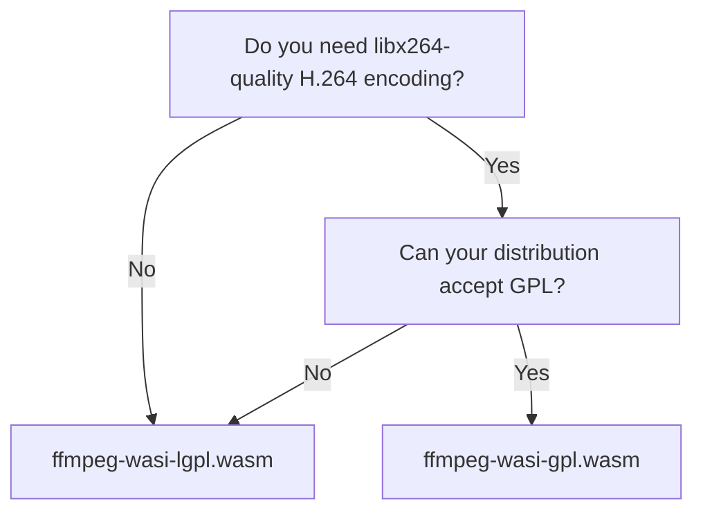

# Choose & verify a variant

Every release ships two modules. Pick by **licence**, then **verify** before you trust it.

## Which one?



- **`ffmpeg-wasi-lgpl.wasm`** — the default. LGPL-2.1+, proprietary-compatible. H.264 encode
  via openh264 (or omitted); everything else in the [baseline](../reference/variants.md).
- **`ffmpeg-wasi-gpl.wasm`** — LGPL plus `--enable-gpl` + libx264 for best-in-class H.264
  encoding. The artifact is GPL-2.0+.

When in doubt, start with **LGPL**. See [the licensing model](../explanation/licensing.md) for
the full picture (and why shipping both together is clean).

## Verify the checksum

Each release includes `checksums.txt`. Always verify the module you downloaded:

```sh
# Download the module + checksums.txt from the release, then:
sha256sum -c checksums.txt --ignore-missing
# ffmpeg-wasi-lgpl.wasm: OK
```

Or check a single file against the published value:

```sh
sha256sum ffmpeg-wasi-lgpl.wasm
```

## Pin it in a consumer

When loading the module from Go via [afmpeg](https://gitlab.com/phpboyscout/afmpeg), pin both
the URL **and** the SHA-256 so an unexpected artifact is rejected:

```go
rt, _ := afmpeg.New(ctx, afmpeg.WithModuleURL(
    "https://gitlab.com/phpboyscout/ffmpeg-wasi/-/releases/n8.1.2-1/downloads/ffmpeg-wasi-lgpl.wasm",
    afmpeg.WithSHA256("<value from checksums.txt>"),
))
```

For exactly what went into a given build (FFmpeg version, dependencies, configure line,
licence), read that release's `provenance.json`.
